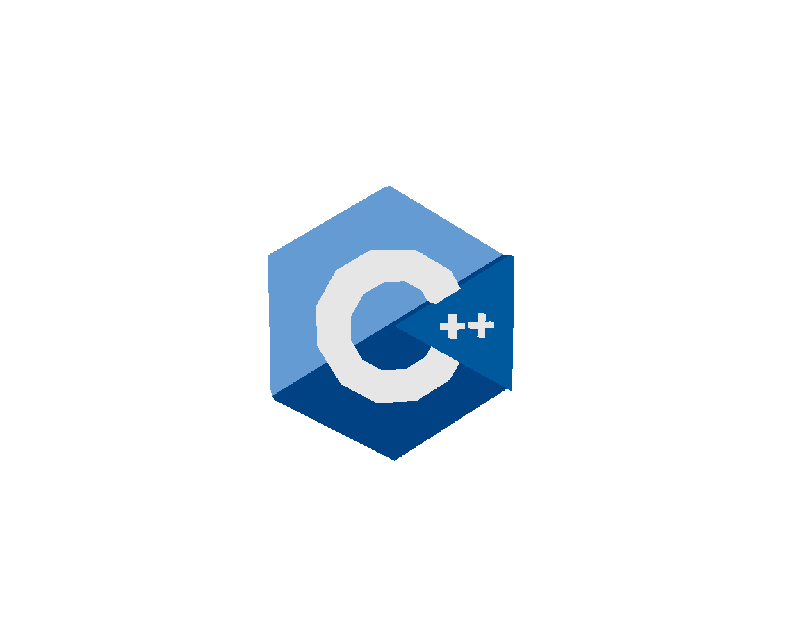

<div align="center">
  <a href="https://github.com/hadi14250">
    
  </a>
  <h3 align="center">cpp-04</h3>
  Subtype polymorphism, abstract classes, and interfaces.
  <br>
  <br>
</div>

<br>

# cpp-04 — Subtype Polymorphism

Where C++ starts to feel like real OOP. Virtual functions enable runtime dispatch; abstract classes and interfaces give you the vocabulary to model "what something *is*" vs. "what something *does*".

<br>

## Exercises

- **ex00 — Polymorphism** — `Animal`, `Dog`, `Cat`, plus a `WrongAnimal` to show what happens *without* `virtual`.
- **ex01 — I don't want to set the world on fire** — Deep copies: each `Dog` and `Cat` carries its own `Brain` on the heap.
- **ex02 — Abstract class** — Make `Animal` abstract by giving it a pure virtual function — no one can instantiate it directly anymore.
- **ex03 — Interface & recap** — Materia & Character: an interface-driven design with cloning and inventory management.

<br>

## Concepts Covered

- `virtual` member functions and the v-table
- Pure virtual functions and abstract classes
- Interfaces in C++ (classes with only pure virtuals)
- Deep copy vs. shallow copy
- Virtual destructors — and why every polymorphic base needs one
- The difference between `WrongAnimal` (no virtual) and `Animal` (virtual) at runtime

<br>

## Build & Run

```sh
cd ex00 && make && ./<binary>
```

<br>
